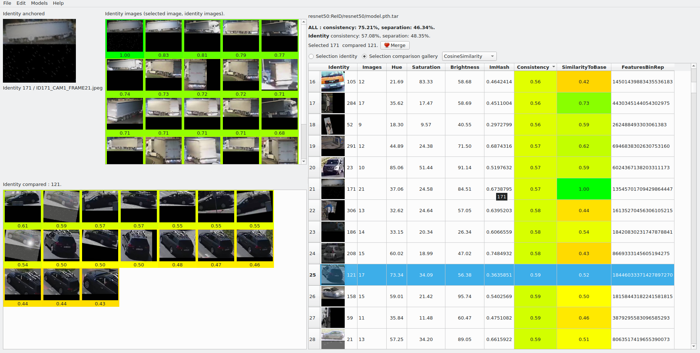

# YAYA - ReID


`YAYA - Yet Another YOLO Annoter` for ReID datasets. Datasets format readed :

  * AISPREID

### Requirements

`pip install -r requirements`


### How to add custom REID Classifiers?


### How to start?

To load all test images from `input` directory and start application, you can use command

`./yaya-reid.py -i input/`

### Command line

```shell
usage: yaya-reid.py [-h] -i INPUT [-c CONFIG] [-on] [-yc] [-v]

optional arguments:
  -h, --help       show this help message and exit
  -i INPUT, --input INPUT
             Input path
  -v, --verbose     Show verbose finded and processed data
```

